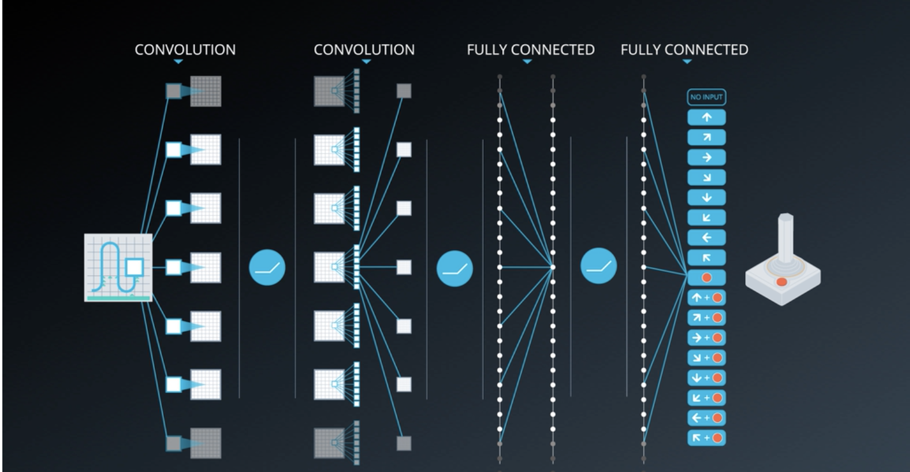
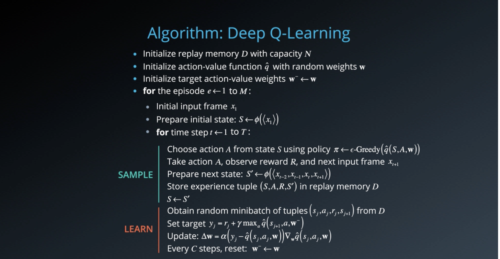
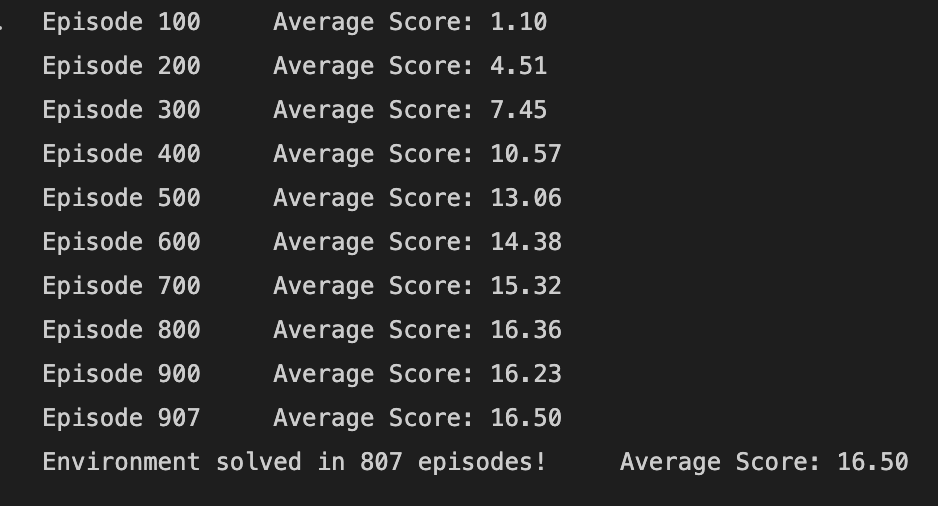
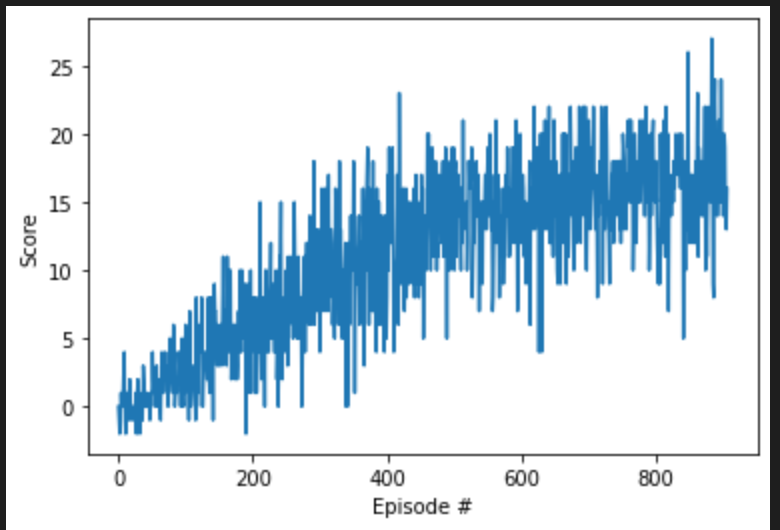

# Deep Reinforcement Navigation

## Introduction

The goal of your agent is to collect as many yellow bananas as possible while avoiding blue bananas.

## Environment

A reward of +1 is provided for collecting a yellow banana, and a reward of -1 is provided for collecting a blue banana. Thus, the goal of your agent is to collect as many yellow bananas as possible while avoiding blue bananas.

The state space has 37 dimensions and contains the agent's velocity, along with ray-based perception of objects around the agent's forward direction. Given this information, the agent has to learn how to best select actions. Four discrete actions are available, corresponding to:

0 - move forward.
1 - move backward.
2 - turn left.
3 - turn right.

The task is episodic, and in order to solve the environment, your agent must get an average score of +13 over 100 consecutive episodes.

The project environment is similar to, but not identical to the Banana Collector environment on the Unity ML-Agents.

## Model Architecture

Deep Q Network
Replay Buffer

## Hyperparameters

> - BUFFER_SIZE = int(1e5)  # replay buffer size 
> - BATCH_SIZE = 64         # minibatch size
> - GAMMA = 0.99            # discount factor
> - TAU = 1e-3              # for soft update of target parameters
> - LR = 5e-4               # learning rate 
> - UPDATE_EVERY = 4        # how often to update the network

## Algorithm

## Results

### Model Training

### Plots of Rewards

## Ideas For Future Works

